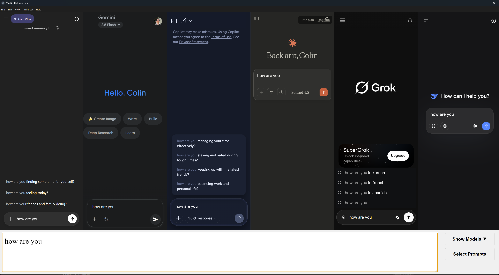

# LLM-God

## Screenshot



This is a desktop app for Windows machines only (currently) that allows users to simultaneously prompt multiple LLM's at once in one environment. I use this app every day, for coding or non coding purposes. It has saved me countless hours of copypasting and is just so much more efficient.

Currently, the following LLM web interfaces are supported:

- ChatGPT
- Google Gemini
- Anthropic Claude
- X.ai Grok
- DeepSeek
- Copilot

## Downloading the App for Personal Use

Go to the Releases section, and download the Setup.exe. It is going to say that Microsoft has flagged this as untrusted. Windows codesigning has not
been done yet, so for now, ignore the warning and proceed to installation. I faithfully swear that this app has no malware and does not intend to hurt anybody. The code is open source, so please feel free to review it thoroughly at your discretion; I have nothing to hide.

The app should open immediately after you bypass the warning and you can add the desktop shortcut to your computer!

## How to Use the App

### Selecting the Model

Use the dropdown at the bottom right corner to add and remove LLM web consoles. By default, ChatGPT, Gemini, and Llama are there by default and cannot be changed.

\*Note that if you are on free tier, then you will face the typical usage limits as specified by the LLM provider.

To launch the prompt to all the LLM's, press Ctrl + Enter on your keyboard

If you want to close the app, press Ctrl + W on your keyboard.

## Disclaimer

I did find out about the [GodMode](https://github.com/smol-ai/GodMode) project, but I felt that people needed an app that just provided the models from the few big companies like OpenAI and Anthropic. Many of the other smaller models are not very useful. In addition, that project doesn't seem to be very well maintained anymore and doesn't have some of the new models like Grok.

## Contributing

New contributions are welcome!

1. Clone the project and navigate to root directory

```
git clone https://github.com/czhou578/llm-god.git
cd llm-god
```

2. Install all dependencies

```
npm install
```

3. Start the app, which will create the shortcut that will also appear on your computer

```
npm run start
```

When developing, instead of running the command above, I like to have two terminals open. One terminal should run the command:

```
npx tsc --watch
```

and the other terminal should run the command:

```
npx electronmon dist/main.js
```

4. To check if the build works properly, run the following command in the root folder

```
npm run make
```

This will create a launchable app in the `/out/app-win32-x64` path. You can then add this to your task bar for daily use outside of development!

Please check out the Issues tab for existing issues to tackle, and feel free to suggest new issues as well! Make a pull request to this repo once a feature or bug fix is done.

When submitting pull requests, please make sure to list the changes made using bullet points. A screenshot showing that the app functionality works as intended would be good too, and lead to faster reviews.

## Debugging Tools

While developing, I liked to have the devtools of the app be visible and also have the option to have hot reloading on every save. Uncomment the following two lines to do so:

```
 mainWindow.webContents.openDevTools({ mode: "detach" });
 require("electron-reload")(path.join(__dirname, "."));
```

## Updates

5/17: Migrated to using TypeScript across the app.
6/15: Added support for LMArena and also for adding custom prompts that can be saved.
10/10: Removed support for Perplexity and LMArena (due to incompatibility) and added more contextual searching for JavaScript injection logic. Added Copilot support.
