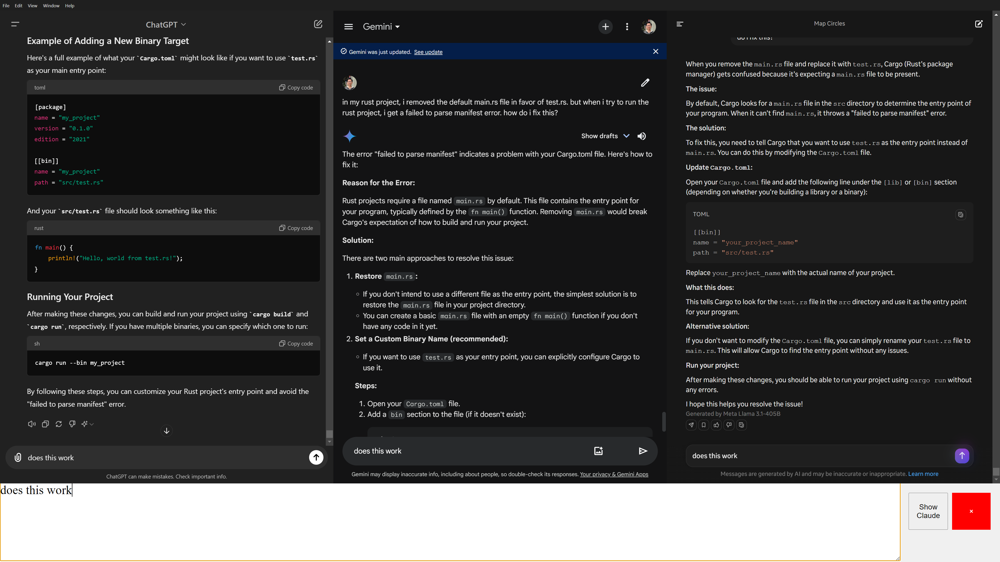

# LLM-God

This is a desktop app for Windows machines (currently) that allows users to simultaneously prompt 4 LLM's at once in one environment. The 4 LLM's are Claude, Gemini, ChatGPT and Meta AI (Llama 3.1).

There is an option to toggle and disable / enable Claude, since for free users, Claude has a restriction on the number of prompts available.

## Disclaimer

This app was inspired by the [GodMode](https://github.com/smol-ai/GodMode) project, and is not intended to be a direct copy or competitor. Rather, I found that I wanted to add in Llama to the supported LLM's, and simplify the app to make it work for my own unique needs.

## Screenshot

